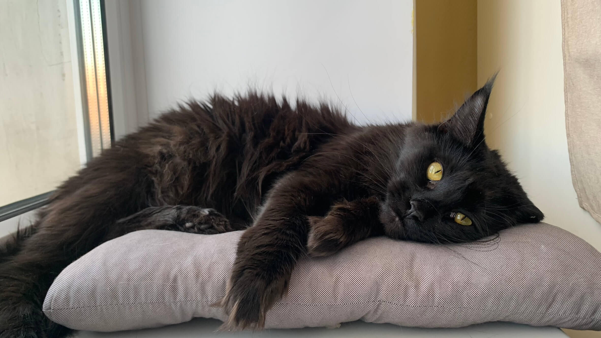
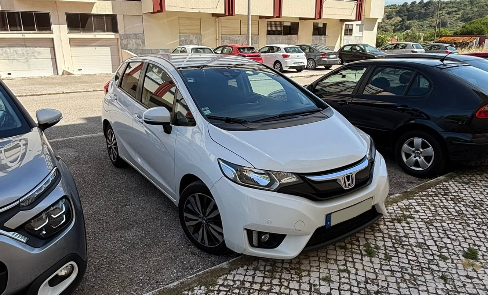
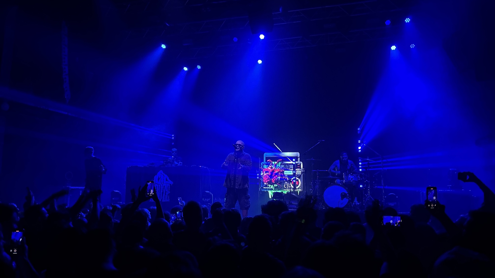
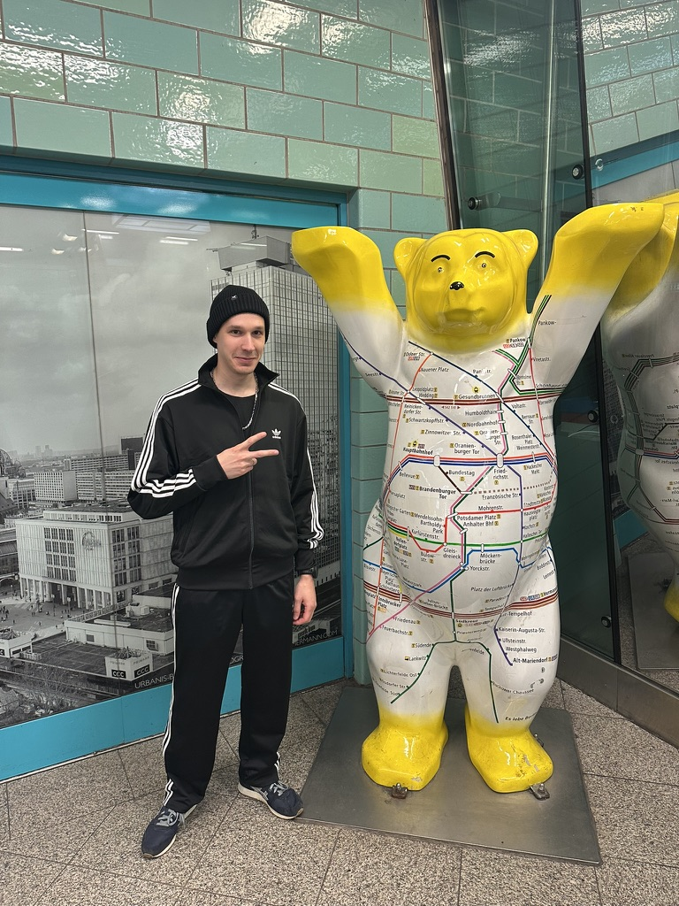
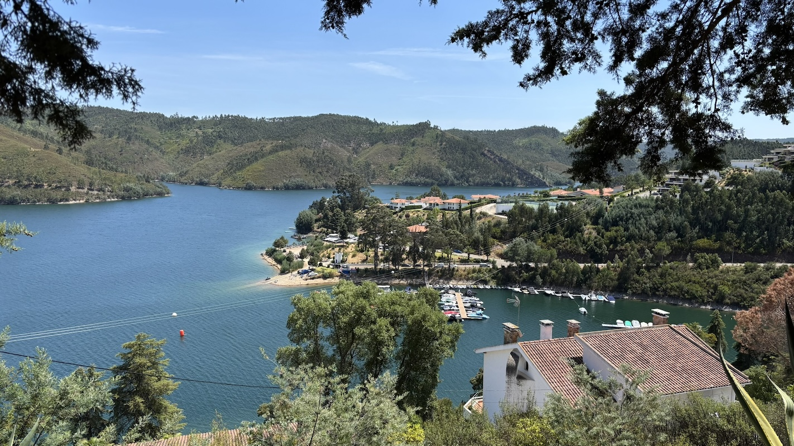
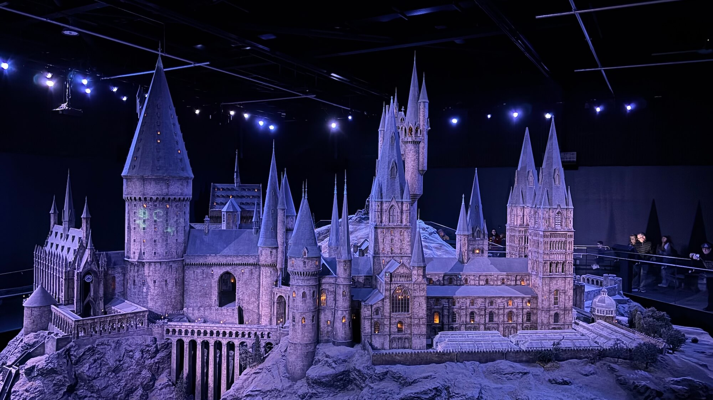

Прошлые итоги: [2024](/notes/bye-2024/), [2019](/notes/bye-2019/), [2018](/notes/bye-2018/), [2017](/notes/bye-2017/), [2016](/notes/bye-2016/)

## Потеря: Рыська

В конце ноября прошлого года мы с женой обратили внимание, что одна из наших кошек, Рыська, стала иногда то ли кашлять, то ли чихать без причины. Посетив ветеринара, мы выяснили, что кашляла она из-за жидкости в лёгких, которая накопилась там из-за подтвердившейся анализами медиастинальной лимфомы.

Следующие полгода мы раз в неделю ходили в ветклинику на сеансы химиотерапии. Нам повезло жить в пятнадцати минутах ходьбы от ветклиники, в которой было всё необходимое для лечения, вплоть до стационара. Рыська держалась молодцом и на протяжении практически всего лечения спокойно относилась как к самим походам в клинику, так и к манипуляциям врачей.

Несмотря на первоначальную эффективность лечения и стойкость Рыськи, на протяжении всего курса она неуклонно худела и теряла аппетит. Под конец курса эффективность лечения снизилась и лимфома снова стала расти, затрудняя её дыхание. Аппетит не возвращался, и ко всему прочему, при очередном откачивании жидкости из лёгких врачи допустили прокол, который привёл к попаданию воздуха наружу лёгких, что ещё сильнее затруднило её дыхание.

В конце мая мы приняли тяжёлое решение усыпить Рыську. Смогли найти врача, который приехал домой и всё сделал, не тревожа её очередным походом в ветклинику. Рыське не было и четырех лет, и меня переполняет грусть, злость и обида на то, что всё так сложилось. Мягких облачков тебе, Рысюх, спасибо за то, что была со мной 💔

<figure>
  
  <figcaption>Рыська, 12.08.2021 — 28.05.2025</figcaption>
</figure>

## Работа

Уже полтора года, как я работаю в [Datadog](https://datadoghq.com). Год начался с реорганизации моего департамента и присоединения к новой команде, которая работает над продуктом для [автоскейлинга Kubernetes](https://www.datadoghq.com/product/kubernetes-autoscaling/).

За прошедший год было много интересного: мы публично запустили продукт; к нам присоединилось много новых крутых ребят и наша команда выросла настолько, что к концу года нас разделили на две команды; мы трижды собрались со всей командой в офлайне (наша команда распределена между Францией, Португалией и США).

Ещё из приятного — в этом году впервые продал завестившиеся акции. Сумма не life changing, но дала больше спокойствия и уверенности в будущем (по крайней мере на горизонте ближайших 1–2 лет).

### Разработка с ИИ

В этом году стал гораздо больше пользоваться AI-ассистентами в работе. В основном использую Cursor, иногда Claude Code, с последним ещё планирую поработать плотнее.

Claude Code я почти не использовал, потому что Cursor стабильно выдавал мне результаты лучше и быстрее. Спустя полгода я выяснил, что у меня была установлена старая версия Claude Code, которая не обновлялась автоматически и не сообщала о том, что она устарела. После обновления всё стало работать быстрее и лучше, плюс за последние месяцы появилась куча новых концепций вроде плагинов и навыков, которые я толком не изучал, так что планирую с ними поэкспериментировать. На этом примере особенно заметно, что инструменты развиваются с бешеной скоростью.

На данный момент наиболее полезный для меня сценарий использования ИИ — исследование большой или незнакомой кодовой базы. Этим я прям доволен и потеря этой возможности будет для меня ощутима: ИИ для меня ищет код, который можно переиспользовать, находит примеры реализации похожих фич, объясняет, как работают те или иные сервисы/эндпойнты на бэкенде.

Второй по пользе и уверенности использования сценарий — генерация юнит-тестов. В этом ИИ закрывает большую часть рутины, остаётся только перепроверить покрытие желаемых сценариев и причесать код.

#### Написание кода

Под конец года стал пробовать больше использовать ИИ для написания кода. Если у меня есть плюс-минус понятная задача, я прошу ИИ написать план её реализации, при необходимости его редактирую, и затем запускаю генерацию кода по написанному плану. Пока что впечатления смешанные.

Первая часть (планирование) для меня полезна тем, что на этом этапе я иногда обнаруживаю нюансы, о которых сам изначально не подумал. Делая задачу самостоятельно, я бы на них напарывался где-то на полпути, и переделывал бы часть уже сделанной работы. Планирование экономит время, подсвечивая эти нюансы заранее.

Когда план готов, я запускаю агента для его реализации. Зачастую написанный код меня по тем или иным причинам не устраивает, и я его дорабатываю. В целом приятно, что не нужно всё писать с нуля; с другой стороны, чем больше задача, тем больше кода от агента нужно прочитать и понять, а это мне нравится меньше.

Как бы то ни было, написание кода по чётко поставленной задаче сейчас составляет малую часть моей работы, поэтому мои возможности для экспериментов на работе ограничены. Временами чувствую дикий <abbr title="Fear of missing out">FOMO</abbr>: один коллега писал, что в их команде продуктивность с ИИ настолько повысилась, что стало не хватать людей для ревью кода.

## Форвеб

До мая старался регулярно публиковать новые материалы в [Форвебе](https://forweb.dev), но чувствовал, что потерял былую мотивацию. Раньше у меня было больше интереса к происходящему во фронтенде, а сейчас присутствует ощущение стагнации. Со стороны опенсорс-сообщества каких-то интересных инноваций или новых подходов я не вижу (возможно они есть, но проходят мимо меня!).

Более интересная движуха происходит со стороны стандартов и браузеров, но она тоже не совсем про инновации — там активно внедряют нативные решения для популярных задач, которые раньше решались только JS-библиотеками. Кроме того, раньше у меня было меньше опыта, поэтому множество уже давно существующих вещей были для меня в новинку, и мне было интересно их изучать и публиковать.

В какой-то момент я решил попробовать найти мотивацию через монетизацию контента, завёл аккаунт на Патреоне и предложил подписчикам закрытый канал с более частыми публикациями в обмен на небольшие донаты. Эта идея потерпела фиаско, а развивать её или пытаться найти другие способы монетизации у меня желания тоже особо не было. В итоге я совсем забросил проект, перестав пытаться вымучить из себя поиск и публикацию новых материалов.

Возможно, со временем мне придёт в голову новый формат, и я перезапущу проект. Возможно, через пару лет наша индустрия и вовсе изменится до неузнаваемости, так что новости фронтенда станут совсем не актуальны :)

## Здоровье и спорт

В плане здоровья год был провальный. Не посетил ни одного врача, хотя нужно бы пройти чекап. В эмиграции посещение врача психологически воспринимается мной гораздо тяжелее, чем в России, в основном из-за языкового барьера.

В начале года решил возобновить регулярное посещение тренажёрного зала, несколько месяцев стабильно посещал зал раз в неделю, но так и не смог заставить себя ходить дважды в неделю. Вместе с посещением зала я решил позаниматься с персональным тренером, взял несколько занятий с местным тренером в своём зале, но этот тренер мне не подошёл. Опять же, языковой барьер, плюс у него был какой-то несистемный подход — он даже не записывал веса, которые мы делали на разных тренажёрах, каждый раз то ли вспоминая их, то ли подбирая заново. В России я занимался с тренером за меньшие деньги, и подход у него был более системный.

В итоге я продолжил заниматься самостоятельно и не стал искать нового тренера. А когда абонемент в зал истёк, не стал его продлевать, потому что простые упражнения, которые я делаю, я могу поделать и дома, у меня есть скамья и наборные гантели.

В целом результатом года считаю то, что я снова почувствовал и хотя бы немного реализовал потребность в движении и физической нагрузке. В следующем году надеюсь найти более интересный спорт, чем тягание железок. Рассчитываю, что благодаря интересу улучшатся и частота и регулярность занятий.

## Жизнь в Португалии

Весь год меня продолжало мучить ощущение вынужденности жизни в эмиграции в целом и в Португалии в частности. В саму Португалию мы переехали лишь из-за того, что мой прошлый работодатель открыл здесь офис. Чем дольше мы здесь живём (в этом году стукнуло два года), тем больше вопросов у меня возникает касательно долгосрочной жизни здесь:
- на что будут идти 48% налогов, которые я буду платить с дохода выше ~80 000 евро в год, когда закончатся мои налоговые льготы?
- какие сюрпризы от правительства меня ждут в течение следующих лет помимо удвоения срока получения гражданства?
- почему на одни и те же 100 000€ в соседней Испании можно купить сносную квартиру, а здесь разве что руины или квартиру с пожизненным арендатором?
- где работать после Датадога? (рынок здесь маленький)
- где работать после Датадога, не теряя ~40-50% уровня дохода? (местные зарплаты грустные)
- почему полиция более чем за три месяца не раскрыла похищение человека в центре Лиссабона, попавшее на камеры?
- почему полиция игнорирует мошенничество и кражи, но не когда [дело касается сына премьер-министра](https://www.nowcanal.pt/ultimas/detalhe/carro-do-filho-do-primeiro-ministro-assaltado-durante-jantar-no-porto)?
- почему хозяева собак не убирают говно за своими питомцами?

В общем, вопросов много, а ответы неутешительные. В начале года я морально был на подъёме касательно жизни здесь, и даже приложил немного усилий к изучению португальского языка, но события второй половины года (частично перечисленные в списке выше) заставили меня задуматься. Пока у меня нет реалистичного ответа на вопрос, где бы я хотел (и мог!) жить, если не в Португалии, но появилось желание поискать этот ответ.

Также в этом году я, кажется, почти принял тот факт, что в Россию я в ближайшие годы не вернусь. В связи с этим начал процессы вроде снятия с учёта в военкомате и продажи недвижимости. Надеюсь их завершить в течение следующего года.

## Покупка автомобиля

Весной я решил, что хотел бы чаще выбираться за пределы Лиссабона, а делать это без автомобиля не очень удобно, хоть и возможно. Так мы решили купить автомобиль, чтобы по выходным кататься по Португалии.

Нужно отметить две особенности португальского авторынка:
1. Неприлично высокие цены, обусловленные двойным налогообложением и пошлинами на ввоз (за что Евросоюз неоднократно штрафовал Португалию, но доходы от этой схемы всё равно превышают штрафы).
2. Популярность автомобилей с механической коробкой передач (думаю, просто потому что они дешевле).

Для меня было важно найти надёжный автомобиль, на обслуживании которого я бы не разорился — автосервисы здесь посредственные и дорогие. Также мне была важна автоматическая коробка передач: на механике я здесь катался, но для меня это стресс из-за небольшого опыта, холмистой местности и местами не самых тривиальных дорожных развязок, проезжая которые не хочется думать ещё и о переключении передач. Ещё я не был готов к универсалам: парковаться в городе на авто с такими габаритами мне было бы некомфортно.

В [местном авточате](https://t.me/autorelocationEC) нашли подборщика, который помог с поиском и проверкой авто, и спустя несколько недель мы нашли и купили Honda Jazz 2016 года на автомате за 14 000€. Искали в основном Тойоты и Хонды до 15 000€, пару раз смотрели Toyota Yaris и Toyota Auris, оба оказались сомнительными восстановленными вариантами с аукционов.

Вообще говоря, такая покупка нерациональна: пользуемся автомобилем мы преимущественно по выходным, его нужно обслуживать, бензин и платные дороги в Португалии недешёвые. Но я всё равно доволен приобретением, эта покупка скорее дала нам эмоции от поездок и ощущение большей свободы и мобильности. Если бы не авто, мы бы посетили гораздо меньше мест — я не так лёгок на подъём, когда приходится искать и бронировать какие-то билеты на автобусы/поезда, зависеть от их времени отбытия/прибытия и так далее.

Ещё я рад, что во время поиска не сдался и не начал рассматривать варианты на механике (хотя мысли были) — всё же автомат даёт неизмеримо больше комфорта при вождении (особенно в пробках!).

<figure>
  
  <figcaption>Honda Jazz в день покупки</figcaption>
</figure>

## Концерты

В этом году посетил всего два концерта: Animal Джаz и ATL.

Концерт ATL был первым в моей жизни рэп-концертом, не знал, чего ожидать, но в итоге отлично провёл время. Очень рад, что удалось попасть на него, учитывая то, что Серёга живёт в России, а о зарубежном туре я узнал случайно буквально за месяц до концерта.

<figure>
  
  <figcaption>Настроились на 66.6FM</figcaption>
</figure>

<figure>
  
  <figcaption>Решил посетить концерт в традиционном славянском костюме</figcaption>
</figure>

## Путешествия

Посетили много новых мест в Португалии: Porto, Tomar, Evora, Peniche, Mafra, Lago Azul, Sesimbra, Serra de Montejunto.

<figure>
  
  <figcaption>Lago Azul: самый чилловый вид, который я встречал в Португалии</figcaption>
</figure>

Увидел Мону Лизу в очередной командировке в Париже.

В очередной командировке в Нью-Йорке:
- сходил на хоккейный матч NHL между New York Rangers и Philadelphia Flyers;
- увидел настоящий Space Shuttle в музее Interpid;
- прогулялся по еврейскому району в Бруклине.

Прогулялся по Барселоне перед концертом Animal Джаz, посмотрел на Саграду Фамилию и на море.

В Берлине увиделись с семьёй Алисы, сходили на концерт ATL, поели лучший донер кебаб, встретился с коллегой.

В октябре впервые побывали в Лондоне. Биг Бен как из учебника по английскому, но весь огорожен чуть ли не колючей проволокой и обвешан камерами. Метро удивило узкими вагонами. На выходе из метро за пределами центра видели шатёр с предложением изучить ислам. Роскошные автомобили в центре, большие парки, холод (после Португальской жары даже приятно!), красивые рестораны с подачей молока к чаю в отдельном сосуде, двухэтажные автобусы как повседневность, динозавры в музее естествознания — в общем, много впечатлений. Отдельно стоит упомянуть экскурсию по студии Warner Bros. с экспозицией о съёмках Гарри Поттера — полный восторг (а для детей там вообще рай, наверное).

<figure>
  
  <figcaption>Модель Хогвартса, которую использовали при съёмках фильмов о Гарри Поттере</figcaption>
</figure>

## Вкратце о других событиях

- Параллельно с лечением Рыськи, у нашей второй кошки Евы обнаружилось 12 (!) камней в мочевом пузыре, которые ей успешно удалили. Теперь она на диете со специальным кормом, но зато здоровая.
- В очередной раз попал в дофаминовую ловушку соцсетей, пришлось заставить себя удалить с телефона тикток, инстаграм, твитер и threads
- Запилил сайт для своего сайд-проекта [Frontend Case Studies](https://frontendcs.com), который до этого существовал просто как [репозиторий на ГитХабе](https://github.com/andrew—r/frontend-case-studies/)
- Во время [десятичасового блэкаута в Португалии](https://en.wikipedia.org/wiki/2025_Iberian_Peninsula_blackout) неприятно удивился полному исчезновению мобильной связи; непонятно, как в таких случаях вызывать экстренные службы или скорую, если возникнет необходимость.
- На Web Summit послушал выступление Светланы Тихановской и был приятно удивлён тем, как она защищает беларусов в эмиграции.
- Арендовал VPS и поднял там всяких self-hosted сервисов, самым полезным оказался [OpenWebUI](https://openwebui.com) в связке с [OpenRouter](https://openrouter.ai).

## Заключение

Всё так же хочется, чтобы новый год принёс окончание войны. Ну а вообще Чемодан неплохо сформулировал:

<blockquote>
  
Двадцать шестой, можешь ничего мне не давать Просто, если можно, никого не отнимай

  <footer>
    <cite><a href="https://youtu.be/Px0o-8SaCZE">The Chemodan — Новогодняя</a></cite>
  </footer>
</blockquote>
