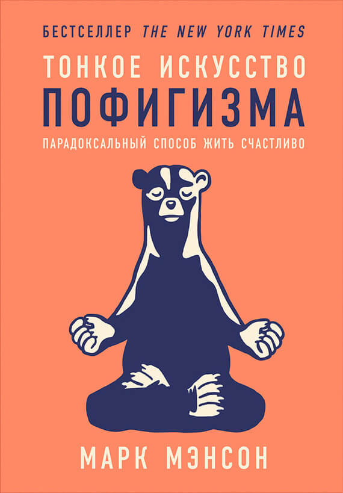

<figure>
  
  <figcaption>Марк Мэнсон, 2018, издательство «Альпина Паблишер», ISBN 978-5-9614-6290-6</figcaption>
</figure>

## О страдании

> Сама жизнь — форма страдания. Богачи страдают из-за богатства. Бедняки страдают из-за бедности. Одинокие люди страдают из-за того, что у них нет семьи. Семейные люди страдают из-за проблем в семье. Люди, ищущие мирских удовольствий, страдают из-за мирских удовольствий. Люди, воздерживающиеся от мирских удовольствий, страдают от воздержания.

> Мы страдаем, потому что страдание биологически полезно. С его помощью природа заставляет нас меняться. Такими нас создала эволюция: мы всегда живём с неудовлетворённостью и беспокойством, поскольку умеренно неудовлетворённое и беспокойное существо прилагает максимум усилий, чтобы создать новшества и выжить.

> Перестаньте спрашивать себя: «Чем я хочу насладиться?». Задайте другой вопрос: «Какая боль мне по душе?». Дорога к счастью усеяна постыдными провалами и кучами дерьма.

## Об уникальности и соцсетях

> То, чего стоит человек, определяется его отношением не к позитивному, а к негативному опыту. [...] Человек, который себя уважает, способен честно отнестись к своим недостаткам и постараться исправиться. Но люди, которые полагают, что они всего достойны, не способны ни признать проблемы открыто и честно, ни улучшить свою жизнь сколько-нибудь прочным и осмысленным образом.

> Чем больше свободы выражения нам дают, тем больше мы хотим освободиться от нужды иметь дело с людьми, которые не согласны с нами или расстраивают нас. Чем чаще мы сталкиваемся с противоположными точками зрения, тем больше мы недовольны, что эти точки зрения существуют. Чем легче и свободнее от проблем становится наша жизнь, тем более уникальными мы считаем оставшиеся проблемы.

> Поток крайностей в современных медиа и соцсетях заставляет нас верить, что исключительность — это норма. А поскольку обычно с нами ничего особенного не происходит, лавина сообщений об исключительном наводит тоску и отчаяние.

> Технологии решили старые экономические проблемы, принеся нам новые психологические проблемы. В интернете мы находим не только лёгкий доступ к информации, но и лёгкий доступ к неуверенности, стыду и сомнениям в себе.

## О ценностях

Три уровня самопознания:

1. Обычное понимание своих эмоций.
2. Способность спрашивать себя, почему мы испытываем определённые эмоции.
3. Осознание личных ценностей: почему мы считаем что-то успехом/неудачей, по какому принципу себя оцениваем, по какому критерию судим о себе и об окружающих.

Ценности лежат в основе всего, что мы делаем. Если ценности гнилые, то всё, что на них основано — мысли, чувства, действия —  пойдёт наперекосяк.

Взгляд на проблемы определяется ценностями и критериями успеха/неудачи. Одни ценности ведут к хорошим проблемам, которые легко и регулярно решаются. Другие ведут к плохим проблемам.

### Гнилые ценности

Некоторые расхожие ценности создают людям неприятные проблемы, которые почти не решаются.

1. *Удовольствие*. Исследования показывают: люди, которые сосредотачивают силы на поверхностных удовольствиях, становятся более тревожными, эмоционально нестабильными и депрессивными. Не нужно гнаться за удовольствием, оно должно возникать само собой, когда мы наладили всё остальное.
2. *Материальный успех*. Как только люди удовлетворяют базовые потребности, корреляция между счастьем и земным успехом быстро стремится к нулю.
3. *Постоянная правота*. Людям присущи постоянные ошибки. Полезнее считать себя невежей и постоянно учиться новому, а не считать себя правым во всём и закрываться от других точек зрения.
4. *Позитивный настрой*. Когда мы заставляем себя сохранять позитив в любой обстановке, мы отрицаем наличие жизненных проблем. А когда мы отрицаем наличие проблем, мы лишаем себя возможности решить их и ощутить счастье. Жизнь такова, что иногда дела идут плохо и мы чувствуем себя хреново. И это нормально. Негативные эмоции — необходимый компонент эмоционального здоровья.

## Принцип «Делайте что-нибудь»

> Не сидите сложа руки. Делайте *что-нибудь*. Ответы придут.

Этот принцип перекликается с принципом Людвига Быстроновского «Просто продолжай». В основе лежит то, что действие — не только следствие мотивации, но и его причина.

## О здоровых отношениях

> Только в нездоровых отношениях люди пытаются решать проблемы друг друга, чтобы ощутить душевный комфорт. В здоровых же отношениях люди решают собственные проблемы из заботы друг о друге.

> Чтобы отношения были здоровыми, люди должны обладать желанием и умением говорить и слышать «да» и «нет». А если никогда не будет отказов, границы рухнут; проблемы и ценности одного человека возобладают над проблемами и ценностями другого. Поэтому конфликт не только нормален: он *абсолютно необходим* для сохранения здоровых отношений. Если близкие люди не способны открыто и честно разобраться со своими разногласиями, значит, отношения основаны на лжи и манипуляции и постепенно станут токсичными.

## О выборе

> «Больше» не всегда «лучше». Зачастую мы счастливее, когда у нас чего-то меньше. Когда мы перегружены возможностями и перспективами, мы страдаем от парадокса выбора. Чем больше возможностей, тем меньше нас удовлетворяет выбранное (а вдруг мы упустили более выгодный вариант?).

> Если серьёзно вкладываться в одного человека, одно место, одну работ и одну деятельность, это лишит заманчивой широты опыта. Однако широта опыта не позволит вкусить плоды, которые даёт *глубина* опыта. [...] Чем старше и опытнее вы становитесь, тем больше приедается каждое занятие. [...] Когда мы отказываемся от лишнего и альтернативного в пользу подлинно важного, наши возможности и шансы *увеличиваются*.

## О смысле жизни

> Если нет причин делать что-либо, нет и причин ничего *не* делать и, коль скоро все мы умрём, нет оснований уступать страху, смущению и стыду; избегая почти всю свою короткую жизнь болезненных и дискомфортных для себя вещей мы, по сути, не живём.
