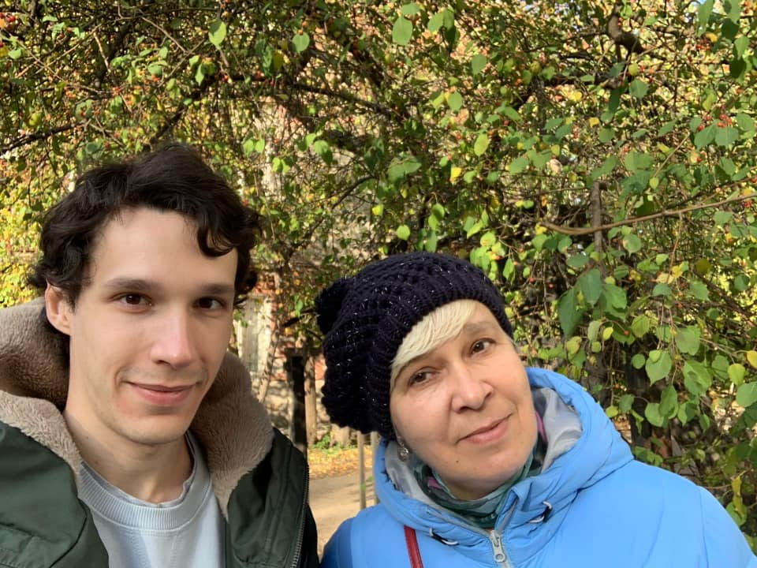

8 октября внезапно не стало моей мамы.

С начала года до августа я доделывал ремонт дома в Омске и к августу мама, наконец, переехала _домой_ после 20 лет скитаний со мной по разным странам и городам. Спустя 13 лет изнурительной работы по шесть дней в неделю преподавателем гитары она, наконец, начала жить ради себя и в своё удовольствие: рисовать картины, вязать мягкие игрушки, писать рассказы, смотреть фильмы, читать книги, гулять по родному городу и фотографировать, приглашать в гости и самой ходить к друзьям и знакомым.

Мне очень обидно, что это продлилось так мало. Что нашим совместным планам теперь не сбыться. Что я не обо всём рассказывал маме, думая, что ещё успеется. Что я уехал в Москву в сентябре и с тех пор увиделся с ней только по прилёте в Омск на выходные в конце сентября. Что я раздражался, когда она просила сфотографировать её или сфотографироваться вместе; а теперь для меня так ценны те фотографии, что мы всё же сделали.

Мне страшно, потому что мама была моим единственным близким родственником. Мне страшно, что мои воспоминания о ней со временем будут угасать. Мне горько думать о том, как мимолётна наша жизнь и как резко она может оборваться, только начав налаживаться.

Строка из песни «Раненый в висок» группы Uma2rman теперь особенно остро отзывается:

> ...кто-то ушёл в мир иной, все остальные в пути.

<figure>
  
  <figcaption>26 сентября 2020</figcaption>
</figure>
