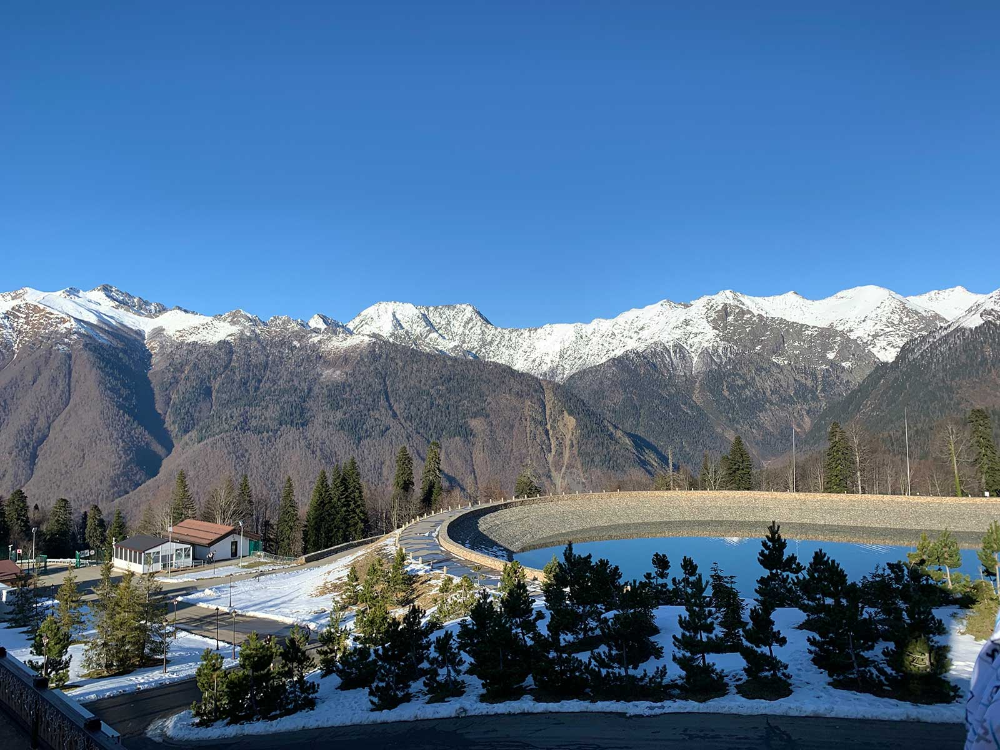

Фиксирую значимые для меня события за прошедший год и немного рефлексирую.

## Работа

В марте этого года я присоединился к команде маркетплейса [Joom](https://www.joom.com/ru/about), и на текущий момент это лучшая компания из тех, где я работал. В Joom сильная команда, интересные и масштабные задачи, а ещё по-настоящему чувствуется забота о сотрудниках.

Я отвечаю за систему обработки обращений пользователей в службу поддержки. В Авито я работал над аналогичной системой, но здесь всё интереснее: я пишу систему с нуля, общение с сервером происходит по вебсокету, система поддерживает разные языки, так как Joom работает во множестве разных стран. Большинство фронтенд-проектов живёт в монорепозитории, мы пишем и поддерживаем общие компоненты и утилиты.

<figure>
  
  <figcaption>Так мы отмечали запуск новой React-версии одного из проектов</figcaption>
</figure>

## Форвеб

Запустил регулярный [дайджест новостей](http://forwebdev.ru/digest) для тех, кто не хочет ежедневно следить за соцсетями. Теперь трачу на него час каждые две недели.

Неудачно попробовал делегировать оформление публикаций. Придётся попробовать ещё раз, иначе у меня так и не будет времени на что-то новое.

## Цель последних трёх лет

В этом году я осуществил цель последних трёх лет: купил квартиру. Исторически сложилось так, что последние 20 лет у моей семьи (то есть у меня и мамы, хах) не было собственного жилья, и я очень рад, что эту проблему удалось решить.

Практически сразу же после покупки мы взялись за ремонт, и такая спешка была ошибкой: она привела к незапланированным тратам и хаосу в процессе. Стоило начать с дизайн-проекта и чёткого списка пожеланий и действий.

## Поездки

### Калининград

В этом году я дважды побывал в Калининграде: первый раз летом приехал на выходные, второй раз осенью на тимбилдинге со своей командой. Куршская коса восхитительна, а сам город жаль — практически вся историческая застройка была разрушена войной.

В первую же поездку в Калининград осуществил своё давнее желание сходить в кино в другом городе: посмотрел в оригинале фильм «Охотник на оленей», который очень удачно оказался в прокате благодаря компании «Иноекино».

<figure>
  
  <figcaption>Недостроенный Дом Советов в Калининграде</figcaption>
</figure>

### Сочи

В Сочи я ездил на новогодний корпоратив Joom. Больше всего меня поразили первые минуты после выхода из аэропорта: конец декабря, на улице светит солнце и люди ходят практически без курток. После серой и холодной Москвы это казалось немыслимым.

<figure>
  
  <figcaption>Просто красивый вид из Сочи</figcaption>
</figure>

### Омск

В Омске я в этом году был трижды: первый раз приезжал летом поностальгировать, второй раз в августе покупал квартиру, третий раз в ноябре приехал на пару недель разобраться с бюрократическими делами. Успел сходить в гости в свою школу, повидаться со знакомыми и друзьями (некоторые из которых вообще случайно оказались в Омске в то же время, что и я), перепрописаться, закрыть ИП, начать ремонт, отдохнуть.

<figure>
  
  <figcaption>Кусочек лета из Омска</figcaption>
</figure>

## Концерты

В этом году помимо уже посещённых ранее Animal Джаz, Машины времени, Uriah Heep и Joe Lynn Turner довелось впервые сходить на Metallica, Muse, Son Lux и Steven Wilson (последний сыграл, наверное, лучший концерт в моей жизни). Я собирался сходить и на Evanescence, но по своей глупости забыл о концерте и вспомнил о нём только когда увидел в соцсетях восторженные отзывы посетителей 🌚.

## Книги

В этом году прочитал ненамного больше книг, чем в прошлом (11 против 8), что печально — перейти от статей к книгам оказалось не так просто. Зато вернулся к чтению художественной литературы, не один же научпоп читать. Также прекратил публиковать конспекты и обзоры прочитанных книг: пользы в этом мало, конспекты я никогда не перечитываю.

Список этого года:

* [Наука сна](/notes/dreamland)
* [Тонкое искусство пофигизма](/notes/the-subtle-art-of-not-giving-a-fuck)
* Deadline. Роман об управлении проектами
* Сделай это завтра
* Управление проектами, людьми и собой
* 11/22/63
* Думай как математик
* Learning English
* Искусство быть невидимым
* Краткая история времени
* Мистер Мерседес

Только в этом году принял и начал применять хорошую мысль о том, что можно читать параллельно несколько разных книг, не нужно браться за одну и не начинать ничего, пока не закончишь её. Раньше я сильно тормозил на неинтересных или сложных книгах, теперь же у меня в процессе 3–4 книги, за которые я берусь по настроению.

## Android → iOS

В этом году впервые перешёл с Android на iOS. Если не считать очень странную работу с файлами на iOS, всё остальное просто отлично. В iOS чувствуется уважение к пользователю и забота о нём. До сих пор каждый день радуюсь стандартному приложению Bedtime и анализу времени сна.

## Психотерапия

Одно из лучших начинаний этого года — регулярные занятия с психотерапевтом. Я созваниваюсь с терапевтом раз в неделю уже более полугода, и благодаря этому я стал лучше разбираться в своих желаниях и чувствах, избавился от некоторых проблем вроде чрезмерной тревожности, осознал наличие и причины других проблем.

## Барабаны

В прошлый новый год я решил, что мне нужно повысить технику игры на барабанах. После недолгих поисков нашёл преподавателя и стал ходить к нему раз в неделю. Купил новый пэд и палочки, заказал домой тренировочную ударную установку. Примерно через полгода я прекратил занятия.

На каждое занятие я приходил с чувством вины за то, что толком не подготовился. Вместо отработки упражнений я чаще садился играть любимые песни. Поразмышляв над этим, я понял, что барабаны для меня — способ выплеснуть энергию, отвлечься от рутины и получить удовольствие от игры. Поставив себе абстрактную цель «поднять технику игры» и записавшись к преподавателю, я превратил способ отдыха в обязательство, которое меня тяготило.

## Английский

Не ставил себе никаких целей по изучению языка, просто подписался на Netflix и стал смотреть все сериалы в оригинале. В какой-то момент заметил, что стал гораздо лучше воспринимать на слух английскую речь: стал различать тексты любимых песен, которые раньше для меня были неразличимым набором звуков. Теперь осталось придумать, как так же ненапряжно прокачать разговорный и письменный английский.

## Разное

Под конец года стал выгружать в Things все дела и идеи, которые приходят в голову. Сразу стало легче — не нужно всё это держать в голове и бояться что-то забыть.

Занялся [англоязычной версией своего сайта](https://andreyromanov.com): добавил разделы Bookshelf и Bookmarks, перевёл пару заметок на английский. Составил большой список того, что хочу видеть на сайте, в новом году планирую заняться этим.

Начал пользоваться в работе эргономичной клавиатурой [Kinesis Advantage 2](https://kinesis-ergo.com/shop/advantage2/) и трекболом [Logitech MX Ergo](https://www.logitech.com/en-us/product/mx-ergo-wireless-trackball-mouse).

Прошёл курс Learning How to Learn, рекомендую всем, кто хочет разобраться в механизмах эффективного обучения.

Стал вести бюджет в приложении [You Need a Budget](http://youneedabudget.com) вместо excel-таблички. Во-первых, это удобнее — теперь всё записываю через мобильное приложение, во-вторых, YNAB предлагает более осознанный подход к бюджетированию, чем просто пассивная запись расходов в табличку.

[Пообщался с ребятами из Хекслета](https://ru.hexlet.io/blog/posts/osnovatel-for-web-andrey-romanov-o-razrabotke-obuchenii-i-perspektivah-frontenda) в формате интервью.

Приобрёл два USB-ключа [OnlyKey](https://onlykey.io), но пока не до конца разобрался со всеми их возможностями, только немного поигрался.

Перешёл с GMail на [Fastmail](http://fastmail.com), пока всё нравится. Помимо почты пользуюсь их календарём, заметками и адресной книгой.

Провёл первый аудит безопасности: удалил все сохранённые пароли из Chrome (которым я больше не пользуюсь), везде поменял пароли и включил 2FA.

Начал использовать [NextDNS](http://nextdns.io) для блокировки рекламы и трекеров на уровне DNS.

Запилил [визуализацию длительности жизни](/timeline), чтобы не забывать о том, что время — невосполнимый и самый ценный ресурс.

Впервые покатался на гидроцикле и на вертолёте.

Посетил хоккейный матч Авангард — Спартак.

## Что было не очень

Давно говорю о вреде соцсетей, но меньше ими не пользуюсь. Периодически удаляю и заново устанавливаю Инстаграм, переводил телефон в чёрно-белый режим и возвращался обратно к обычному, пробовал ограничивать время пользования приложениями. Давно чувствую проблемы с вниманием и концентрацией, и пока борьба с соцсетями не привела к их решению.

Из-за тех же проблем с вниманием и концентрацией хаотично читаю статьи вместо книг.

Брался за чтение технических книг вроде «Дискретной математики для программистов», но не хватило усидчивости и мотивации, чтобы планомерно осваивать материал.

Плохо поддерживал связь с друзьями и редко куда-то выбирался с ними. Иногда возникает ощущение, что я просто не понимаю, как это должно работать, из-за чего становится грустно.

Слишком быстро ввязывался в отношения, не разбираясь в своих мотивах и не устанавливая правильные границы.

Подолгу не отвечал людям в мессенджерах, потому что не было на это сил.

Регулярно делал зарядку каждое утро в течение пары месяцев, а потом забил.

По будням часто спал меньше восьми часов.

## Заключение

Я разочаровался в целеполагании, так что не собираюсь больше ставить себе никаких целей, всё равно к концу года они окажутся неактуальны или более не интересны.

Зафиксирую лучше текущие мысли и желания:

* пора заняться здоровьем, устранить давние болячки и убедиться в отсутствии новых (или присутствии, здесь уж как повезёт);
* в жизни стало слишком много рутинной деятельности, нужно освобождать время для обучения, экспериментов и чего-то нового;
* жить в Москве некомфортно, после ремонта хочу попутешествовать и понять, где было бы комфортнее;
* надо бы более позитивно смотреть на мир, а то сейчас во всём ищу проблемы и ошибки.
